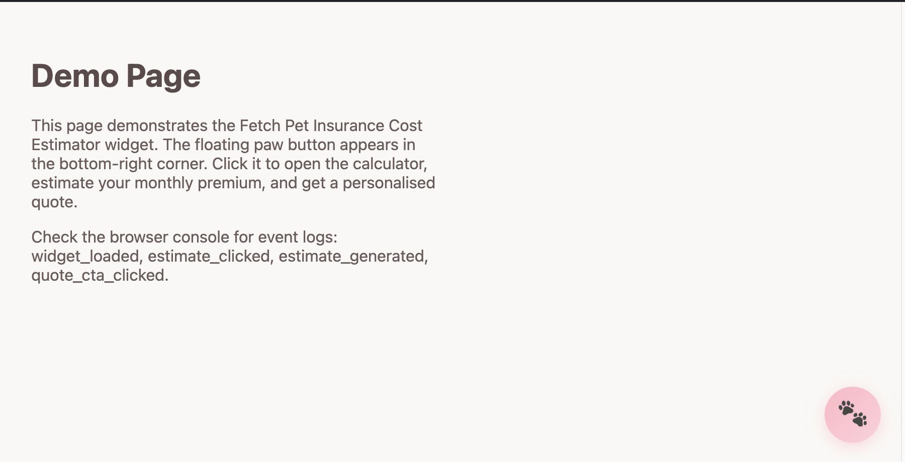
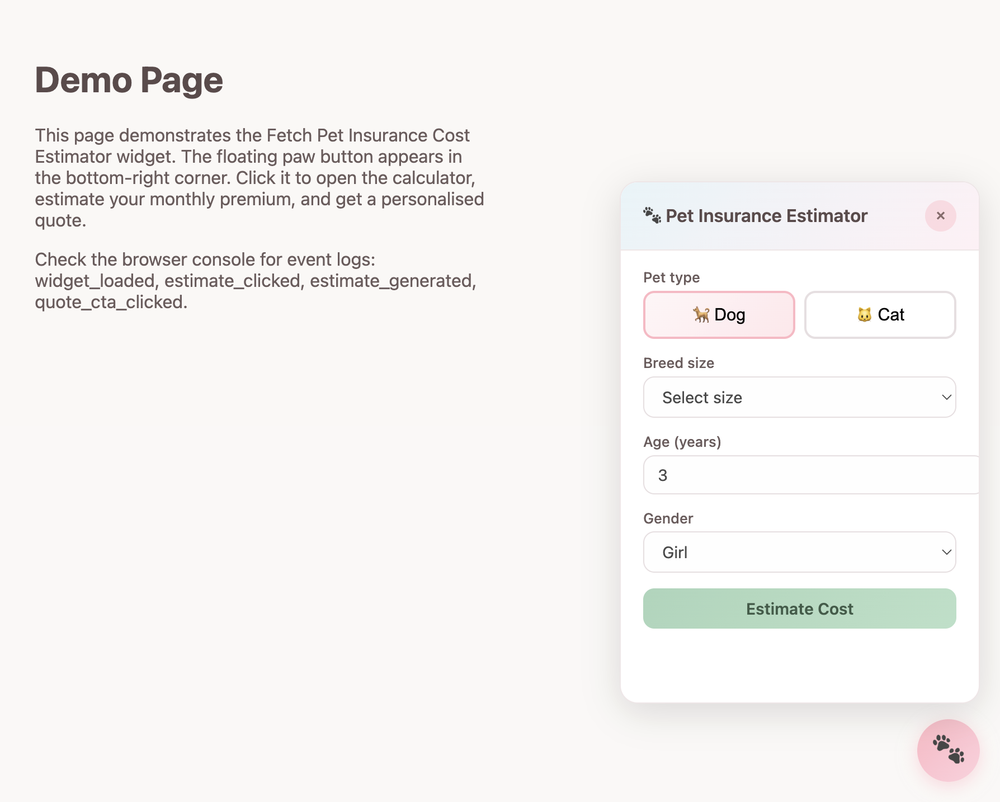
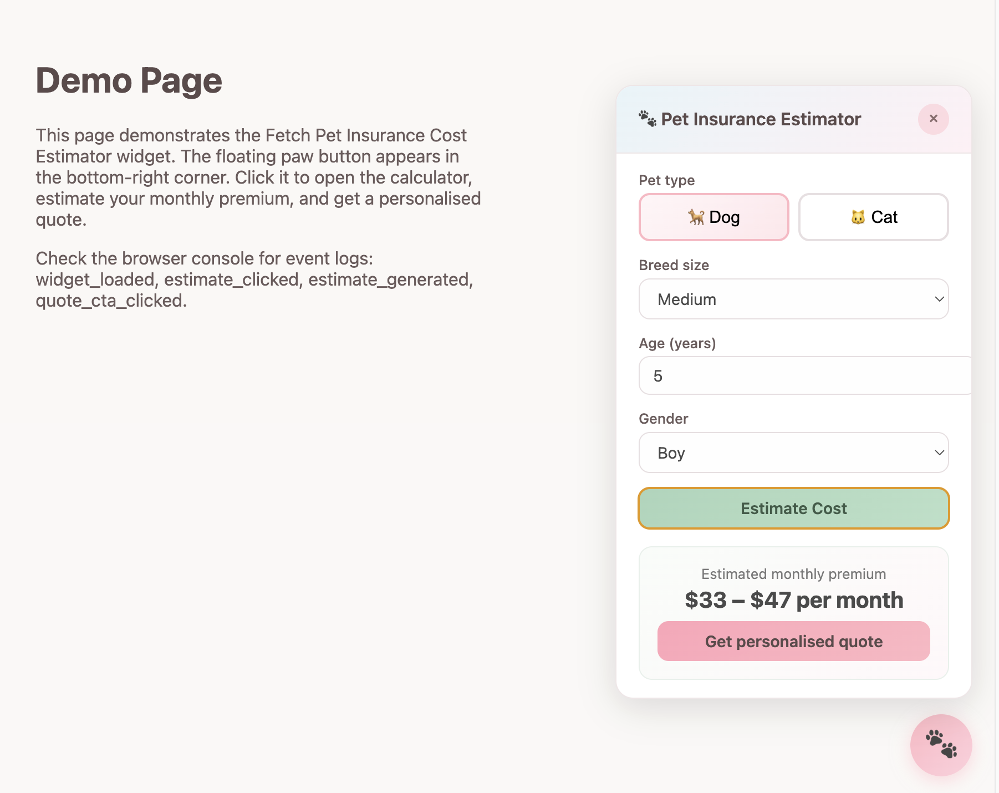

# 🐶 Fetch Pet Insurance Estimator Widget 🐱

💰 A lightweight growth widget prototype that estimates monthly pet insurance costs.

🥏 The widget appears as a floating button in the bottom-right corner of a page. When opened, it expands into a small calculator panel where users can quickly estimate their pet insurance premium and proceed to a quote.

This project simulates the kind of **conversion surface / growth experiment** often used on product landing pages.

Built with plain **HTML, CSS, and JavaScript** (no frameworks).

---
## Preview



The widget appears as a small floating paw button in the bottom-right corner of the page.  
It stays unobtrusive until the user clicks it to open the estimator.


Clicking the button opens a lightweight calculator panel where users can enter basic pet details such as type, breed size, age, and gender.


After submitting the form, the widget generates an estimated monthly premium range and provides a call-to-action to continue to a personalised quote.


## Features 🧾

- Floating widget launcher (bottom-right corner)
- Pet insurance cost estimator
- Inputs for:
  - Pet type (dog / cat)
  - Breed size
  - Age
  - Gender
- Estimated monthly premium range
- Conversion CTA: **Get personalised quote**
- Close / reopen panel interaction
- Mobile-friendly layout
- Lightweight and framework-free

---

The widget is self-contained and can be embedded into any website.

---

## Embedding the Widget

To embed the widget on a website, add the script before the closing `</body>` tag:

```html
<script src="https://your-domain.com/widget.js"></script>
<script>
FetchWidget.init();
</script>
